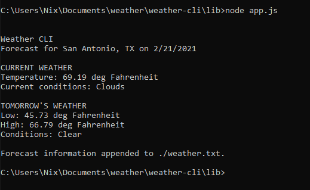
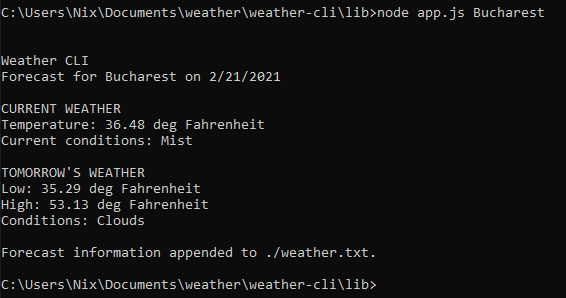
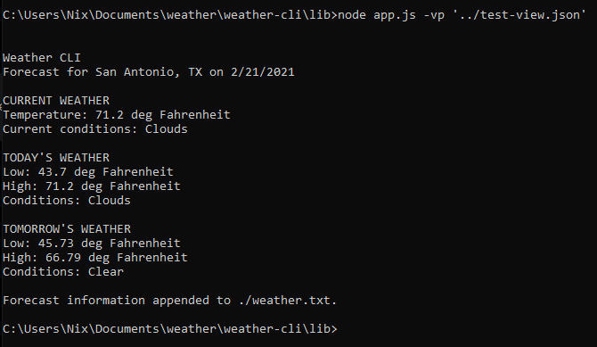
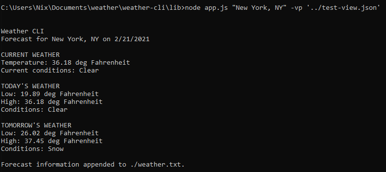

# Weather CLI
Command-line interface for retrieving weather data. 

## Overview
This project was written for the Solo Project Tier 3 requirement for [chingu.io](https://chingu.io).

### Dependencies
Run Dependencies | Dev Dependencies 
-----------------|-----------------
`dotenv` | `typescript`  
`yargs` | `ts-node`
`node-fetch` | `@types/node`

## Usage

### Setting Up

1. Clone the repo and install dependencies:  
   ```
   git clone https://github.com/NixAshes/weather-cli
   cd weather-cli
   npm install
   npm run build
   ```

2. Create your .env file
   - A template is available in the repo as `env-template.txt`.
   - You'll need to get your own API keys from [MapQuest](https://mapquestapi.com) and [Open Weather Map](https://openweathermap.org/api).
   - Open the template in a text editor and replace 'MAPQUEST API KEY' with your (Mapquest) key. Replace 'OPEN WEATHER MAP API KEY' with your (OWM) key. 
   - Save the file in the `lib` folder as `.env`.
   
3. Set your defaults
   - In the project folder, open `config.json` in a text editor.
   - Replace the values as you like - to default to Celsius, change "default_units" to "metric".
   - Save `config.json` to the `lib` folder.
   
### Running

#### Default mode:

In the lib folder, run `node app.js`:



The CLI will present current and tomorrow's weather conditions for the location set in the `local` config variable.


#### Provide a city:

You can also run `node app.js Bucharest`:



If you need to provide a state or country, you can wrap the whole thing in double quotes, i.e. `"Paris, TX"` or `"Paris TX"`.


#### Provide a custom view:

From the lib folder, try running `node app.js -vp '../test-view.json'`:



The app will read a .json file provided and attempt to parse it into a view, which will then be sent to both the console output and file output. If you'd like to try defining your own views, the interface definition is [here](src/view/view.ts), and the [test-view.json](test-view.json) file can be used for an example. :smile:

Of course, the custom view can be used with any location provided, i.e. `node app.js "New York, NY" -vp '../test-view.json'`:




## What's Next

- [ ] Finish decoupling weather-specific implementation from the code structure
- [ ] More thorough documentation
- [ ] Custom API Configuration
- [ ] Command-line Custom View Configuration
- [ ] Multi-response data aggregation

I'm working on an offshoot idea to turn this app into a complete API-fetcher-and-presenter, so JSON responses can be presented (and/or aggregated with other API responses) in views that can be interactively configured completely from the CLI.
